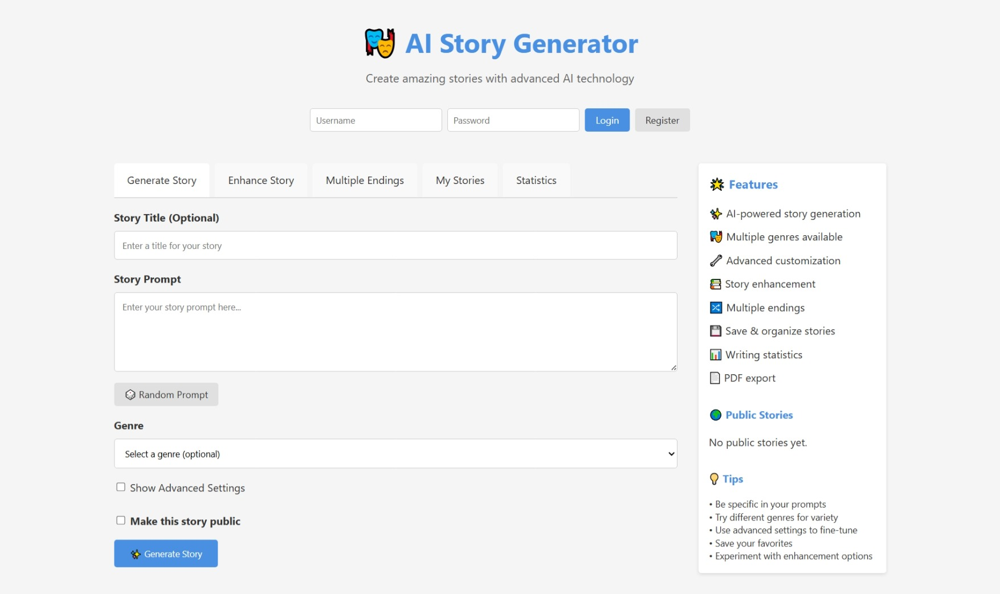
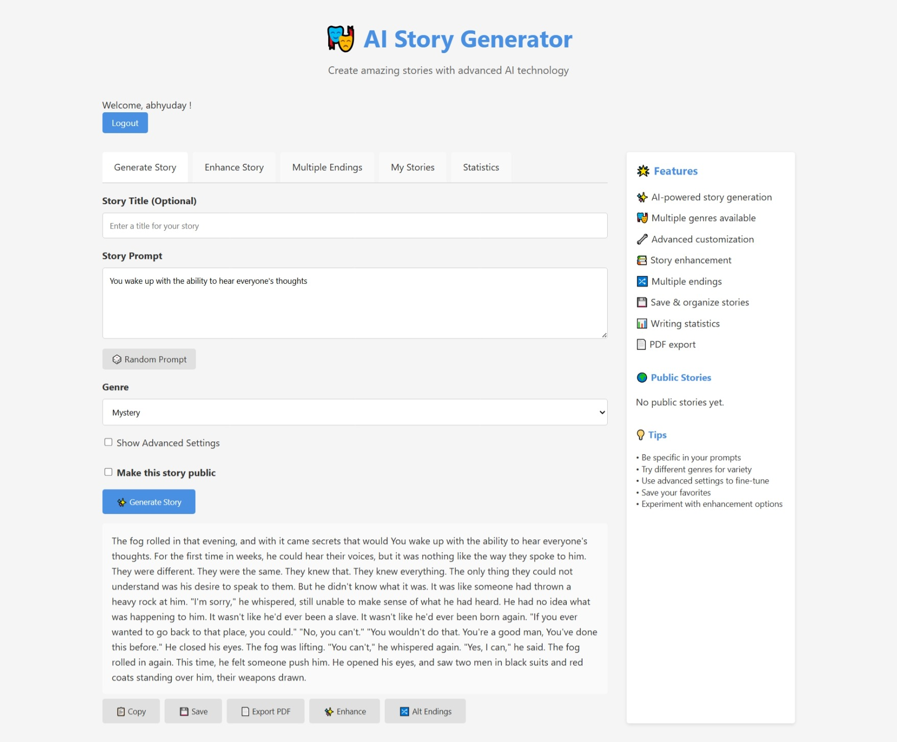
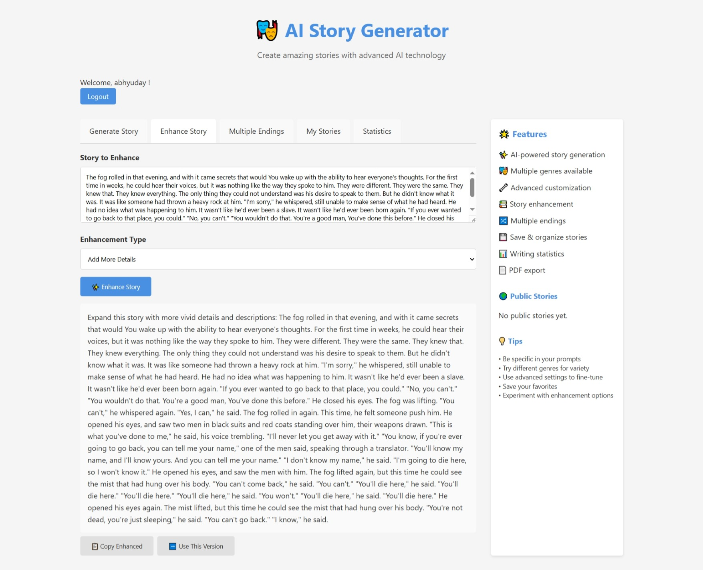
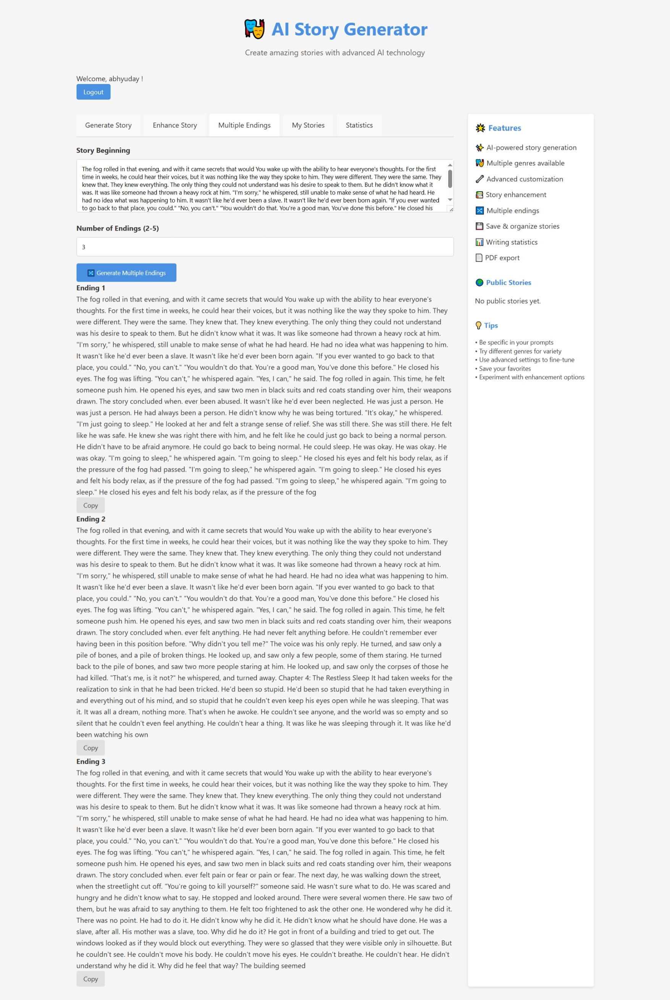
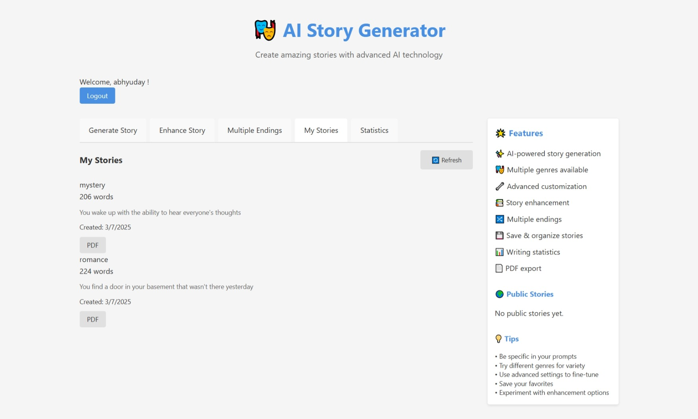
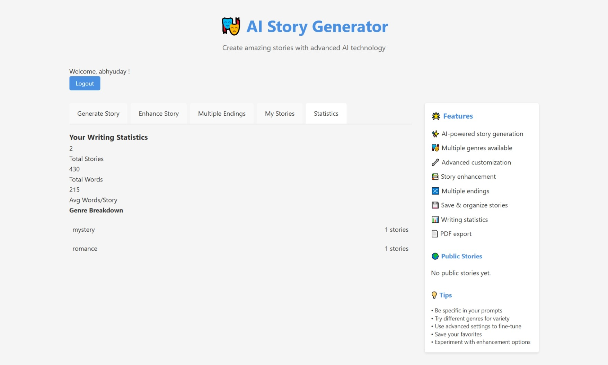

Here's a rewritten version of your `README.md` file. It's cleaner, more concise, and formatted for clarity while keeping all key details:

---
 
 
 
 
 

# AI Story Generator with Flask 📚✨

A feature-rich Flask web app powered by GPT-2, designed to turn your story prompts into full-length narratives. Includes user accounts, story enhancement tools, export options, and a creative dashboard.

## 🚀 Features

### 🤖 AI Story Writing

* **Powered by GPT-2 Medium**
* **Genre Selection**: Fantasy, Sci-fi, Romance, Mystery, Horror, Adventure, Comedy
* **Custom Settings**: Control length, creativity (temperature), and coherence (top\_p)
* **Story Enhancer**: Add more depth, emotion, or action
* **Alternative Endings**: Create multiple outcomes for a story

### 👤 User Accounts

* Register, login, and manage stories securely
* Save stories privately or share with the community
* View genre preferences and story stats

### 📦 Export & Community

* **PDF Export** for beautifully formatted downloads
* **Story Collections**: Organize and manage favorites
* **Community Hub**: Browse stories from other users

### ✨ Creative Toolbox

* **Prompt Generator**
* **Writing Analytics** (word count, genre distribution)
* **Model Status Monitor**

---

## 🛠️ Installation

### Prerequisites

* Python 3.7+
* `pip` installed

### Quick Start (Windows)

```bash
# Clone/download the project and run
setup.bat
```

This sets up a virtual environment, installs dependencies, launches the app, and opens your browser.

### Manual Setup (All Platforms)

```bash
python -m venv venv
# Activate
# Windows:
venv\Scripts\activate
# macOS/Linux:
source venv/bin/activate

# Install packages
pip install -r requirements.txt

# Run app
python app.py
```

Visit [http://localhost:5000](http://localhost:5000)

---

## 📚 Project Structure

```
flask-story-generator/
├── app.py               # Main application
├── requirements.txt     # Dependencies
├── setup.bat            # Windows setup
├── models/              # GPT-2 model files
├── templates/           # HTML UI
├── static/              # CSS & JS
└── stories.db           # SQLite database (auto-generated)
```

---

## 🧪 API Overview

### Story APIs

* `POST /generate` – Create a new story
* `POST /enhance` – Add improvements
* `POST /multiple-endings` – Generate alternate endings

### User APIs

* `POST /register`, `POST /login`, `POST /logout`

### Story Management

* `GET /my-stories`, `GET /public-stories`, `GET /story-stats`

### Utilities

* `GET /random-prompt`, `GET /model-info`, `GET /health`, `GET /export-pdf/<story_id>`

---

## 🧩 Dependencies

```text
Flask, torch, transformers, reportlab, numpy, tokenizers,
huggingface-hub, accelerate, protobuf, requests, Pillow, Werkzeug
```

---

## ⚙️ Configuration

### Model Setup

```python
self.model_name = "gpt2-medium"
self.models_dir = "./models"
```

### Secret Key (update for production)

```python
app.secret_key = 'your-secure-secret-key-here'
```

---

## 🧾 Database Overview

### Tables

**Users**: id, username, email, password\_hash, created\_at
**Stories**: id, user\_id, title, prompt, story, genre, word\_count, rating, created\_at, is\_public
**Favorites**: id, user\_id, story\_id, created\_at

---

## 🛠 Troubleshooting

* **Model Download Fails**: Retry or check disk/internet
* **CUDA Issues**: Runs on CPU by default
* **Port Conflicts**: Change port in `app.py`
* **DB Errors**: Delete `stories.db` to reset

### Performance Tips

* First run may be slow (model loading)
* Lower `max_length` for faster results
* Use GPU for significant speed boost

---

## 🤝 Contributing

Improvements welcome:

* Add new models or genres
* UI/UX enhancements
* Collaborative storytelling
* Mobile support

---

## 📃 License

Licensed under the MIT License.

---

## 📞 Support

Having issues?

* Recheck installation steps
* Review terminal errors
* Ensure Python 3.7+ is installed
* All dependencies installed?

---

## 🧠 Technical Info

* **Model**: GPT-2 Medium (355M parameters)
* **Frameworks**: Flask + Hugging Face Transformers
* **Storage**: Local (500MB model, \~2GB RAM use)
* **Performance**: \~2–10s per generation

---

**✨ Let your creativity run wild. Build worlds with AI. Happy writing!**

---

Let me know if you'd like this in a downloadable format or if you'd like a short version for GitHub!
